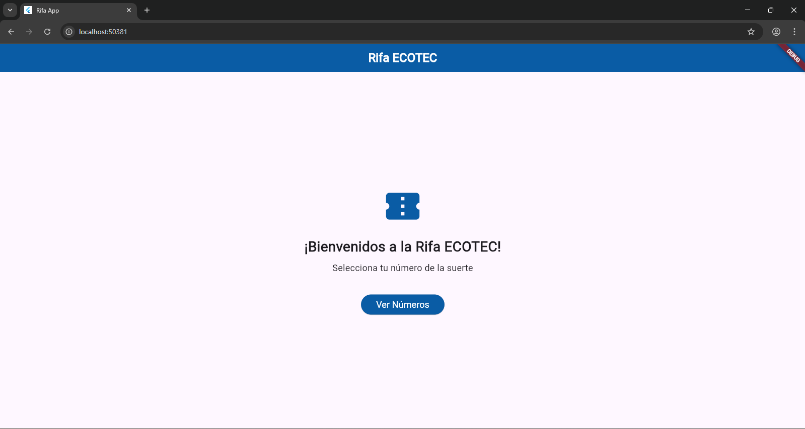
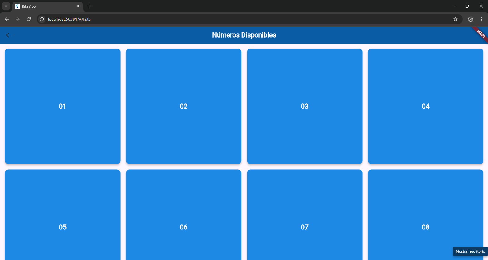
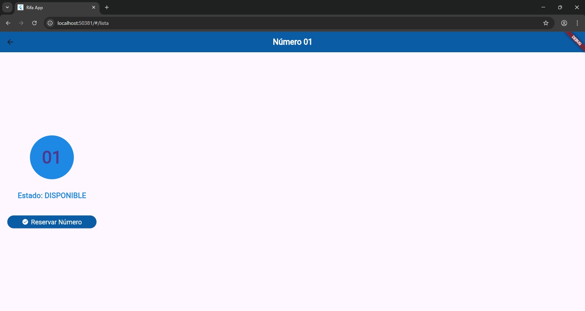
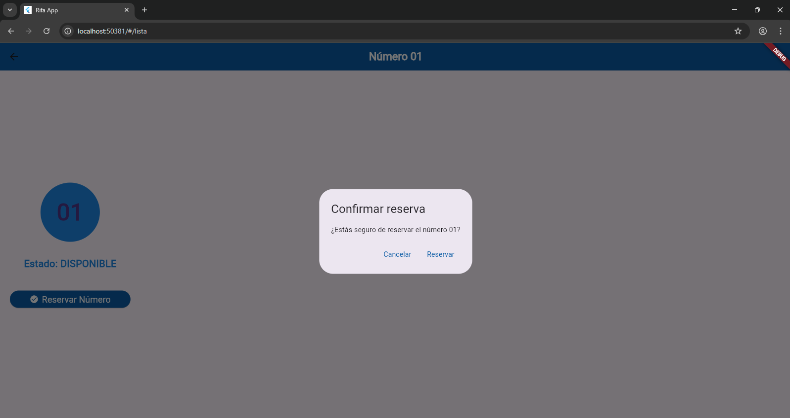

# Rifa ECOTEC - App Móvil en Flutter

**Autor:** CHRISTIAN ARGUELLO CAGUA  
**Curso:** DESARROLLO DE APLICACIONES MÓVILES
**Fecha:** 03-05-2026

---

## Descripción breve

Aplicación desarrollada en **Flutter** que simula una rifa digital con 20 números.  
Permite al usuario visualizar los números disponibles, seleccionar uno, ver su detalle y realizar una reserva simulada con confirmación.  

La app utiliza **datos estáticos** (listas en Dart), **navegación entre pantallas** y una interfaz con colores similares a los de mi institución educativa **Universidad ECOTEC**.

---

## Funcionalidades implementadas

- Pantalla de bienvenida (Home) con título centrado y botón de acceso.
- Lista de 20 números (01 al 20) en formato de cuadrícula.
- Estado visual de cada número:  
  - **Disponible** (azul claro)  
  - **Reservado** (rojo)
- Selección de un número disponible → navegación a pantalla de detalle.
- En el detalle se muestra el número, su estado y un botón para reservar.
- Al reservar, se muestra un **diálogo de confirmación**.
- Cambio automático del estado del número en la lista al regresar.

---

## Capturas de pantalla

### Pantalla Home

### Pantalla Lista de números

### Pantalla Detalle (número disponible)

### Diálogo de confirmación

---

## Tecnologías usadas

- **Flutter** 3.x (Dart)
- **Material Design**
- **Datos estáticos**: lista de objetos `NumeroRifa`
- **Navegación**: `Navigator.push` y rutas nombradas

---

## Estructura del proyecto

app_rifa/
├── lib/
│ ├── main.dart
│ ├── models/
│ │ └── numero_rifa.dart
│ └── screens/
│ ├── home_screen.dart
│ ├── lista_numeros_screen.dart
│ └── detalle_numero_screen.dart
├── screenshots/
│ ├── home.png
│ ├── lista.png
│ ├── detalle.png
│ └── dialogo.png
├── pubspec.yaml
└── README.md

- `lib/`: Contiene todo el código fuente de la aplicación.
- `models/`: Define la clase `NumeroRifa` (datos de cada número).
- `screens/`: Cada pantalla en un archivo independiente.
- `screenshots/`: Imágenes usadas en este README.